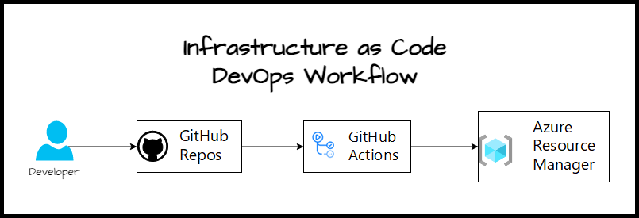
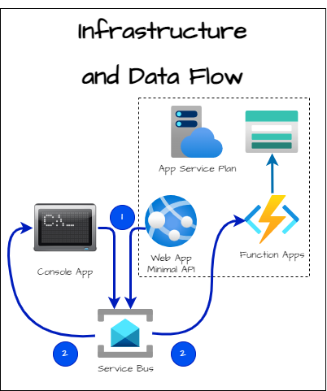

# Santa Clara Bicep Demo Nov 2023

## Demo Architecture

### Infrastructure Provisioning with Bicep



### Infrastructure and Data Flow



[GitHub Actions](https://docs.github.com/en/actions) is a suite of features in GitHub to automate your software development workflows.

We will use the [GitHub Actions for Azure Resource Manager deployment](https://github.com/marketplace/actions/deploy-azure-resource-manager-arm-template) to automate deploying a Bicep file to Azure.

It provides a short introduction to GitHub actions and Bicep files. If you want more detailed steps on setting up the GitHub actions and project, see [Deploy Azure resources by using Bicep and GitHub Actions](https://learn.microsoft.com/en-us/training/paths/bicep-github-actions).

## Deploy Bicep files by using GitHub Actions

In this article will cover the following topics:

- [Prerequisites](#prerequisites)
- [Create resource group](#create-resource-group)
- [Generate deployment credentials](#generate-deployment-credentials)
- [Configure the GitHub secrets](#configure-the-github-secrets)
- [Add a Bicep file](#add-a-bicep-file)
- [Create workflow](#create-workflow)
- [Check workflow status](#check-workflow-status)
- [Clean up resources](#clean-up-resources)

## Prerequisites

- An Azure account with an active subscription. [Create an account for free](https://azure.microsoft.com/free).
- A GitHub account. If you don't have one, sign up for [free](https://github.com/join).
- A GitHub repository to store your Bicep files and your workflow files. To create one, see [Creating a new repository](https://docs.github.com/github/creating-cloning-and-archiving-repositories/creating-a-new-repository).

## Create resource group

Create a resource group. Later in this quickstart, you'll deploy your Bicep file to this resource group.

```azurecli
az group create -n exampleRG -l westus
```

## Generate deployment credentials

Your GitHub Actions run under an identity. I'm giving you my PowerShell script [rbac.ps1](./rbac.ps1) I've created for this purpose. To execute it:

```powershell
.\rbac.ps1 -tenantId <tenantId> -subscriptionId <subscriptionId> -applicationName <applicationName> -githubOrg <githubOrg> -repoName <repoName>
```

References used to create this script:

- [az ad sp create-for-rbac](https://learn.microsoft.com/en-us/cli/azure/ad/sp#az-ad-sp-create-for-rbac) command to create a service principal for the identity.

> ***Important***: *The scope should limited to the resource group as much as possible. It is recommend that you grant minimum required access.*

The output are three variables with the role assignment credentials that provide access to your Azure subscription similar to below. Copy each variable name and value into GitHub repository secrets

```text
AZURE_TENANT_ID: <TenantId>
AZURE_SUBSCRIPTION_ID: <SubscriptionId>
AZURE_CLIENT_ID: <ClientId>
```

## Configure the GitHub secrets

Create secrets for your Azure tenant Id, subscription Id, and client Id.

1. In [GitHub](https://github.com), navigate to your repository.
1. Select Security > Secrets and variables > Actions > New repository secret.
1. Create a secret named `AZURE_TENANT_ID`. Add your tenant Id to the secret's value field.
1. Create another secret named `AZURE_SUBSCRIPTION_ID`. Add your subscription Id to the secret's value field.
1. Create another secret named `AZURE_CLIENT_ID`. Add your client Id to the secret's value field.
1. Create variable named `RESOURCE_NAME`. Add the name of your common application naming to the secret's value field. This will be used to create unique names for resources.

## Add a Bicep file

Add a Bicep file to your GitHub repository. The following Bicep file creates a storage account:

```bicep
@minLength(3)
@maxLength(11)
param storagePrefix string

@allowed([
  'Standard_LRS'
  'Standard_GRS'
  'Standard_RAGRS'
  'Standard_ZRS'
  'Premium_LRS'
  'Premium_ZRS'
  'Standard_GZRS'
  'Standard_RAGZRS'
])
param storageSKU string = 'Standard_LRS'

param location string = resourceGroup().location

var uniqueStorageName = '${storagePrefix}${uniqueString(resourceGroup().id)}'

resource stg 'Microsoft.Storage/storageAccounts@2021-04-01' = {
  name: uniqueStorageName
  location: location
  sku: {
    name: storageSKU
  }
  kind: 'StorageV2'
  properties: {
    supportsHttpsTrafficOnly: true
  }
}

output storageEndpoint object = stg.properties.primaryEndpoints
```

The Bicep file requires one parameter called storagePrefix with 3 to 11 characters.

You can put the file anywhere in the repository. The workflow sample in the next section assumes the Bicep file is named main.bicep, and it's stored at the root of your repository.

## Create workflow

A workflow defines the steps to execute when triggered. It's a YAML (.yml) file in the **.github/workflows/** path of your repository. The workflow file extension can be either **.yml** or **.yaml**.

To create a workflow, take the following steps:

1. From your GitHub repository, select Actions from the top menu.
2. Select **New workflow**.
3. Select **set up a workflow yourself**.
4. Rename the workflow file if you prefer a different name other than main.yml. For example: **deployBicepFile.yml**.
5. Replace the content of the yml file with the following code:

    ```yaml
    on: [push]
    name: Azure ARM
    jobs:
      build-and-deploy:
        runs-on: ubuntu-latest
        steps:
    
          # Checkout code
        - uses: actions/checkout@main
    
          # Log into Azure
        - uses: azure/login@v1
          with:
            creds: ${{ secrets.AZURE_CREDENTIALS }}
    
          # Deploy Bicep file
        - name: deploy
          uses: azure/arm-deploy@v1
          with:
            subscriptionId: ${{ secrets.AZURE_SUBSCRIPTION }}
            resourceGroupName: ${{ secrets.AZURE_RG }}
            template: ./main.bicep
            parameters: 'storagePrefix=mystore     storageSKU=Standard_LRS'
            failOnStdErr: false
    ```

    Replace `mystore` with your own storage account name prefix.

    > ***Note***: *You can specify a JSON format parameters     file instead in the ARM Deploy action (example: .    azuredeploy.parameters.json).*

    The first section of the workflow file includes:

    - **name**: The name of the workflow.
    - **on**: The name of the GitHub events that triggers the     workflow. The workflow is triggered when there's a push     event on the main branch.

6. Select **Start commit**.
7. Select **Commit directly to the main branch**.
8. Select **Commit new file** (or **Commit changes**).

Updating either the workflow file or Bicep file triggers the workflow. The workflow starts right after you commit the changes.

## Check workflow status

1. Select the **Actions** tab. You'll see a **Create deployStorageAccount.yml** workflow listed. It takes 1-2 minutes to run the workflow.
2. Select the workflow to open it.
3. Select **Run ARM deploy** from the menu to verify the deployment.

## Clean up resources

When your resource group and repository are no longer needed, clean up the resources you deployed by deleting the resource group and your GitHub repository.

```azurecli
az group delete --name exampleRG
```

---
Reference: <https://learn.microsoft.com/en-us/azure/azure-resource-manager/bicep/deploy-github-actions?tabs=userlevel%2CCLI>
